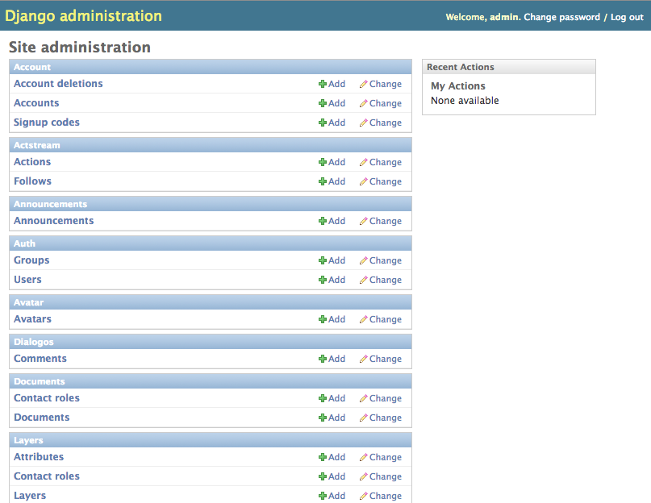
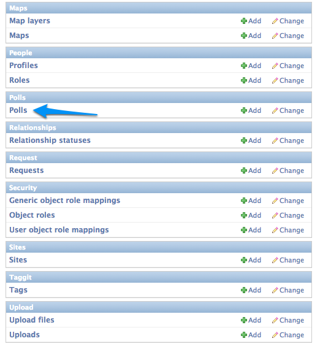
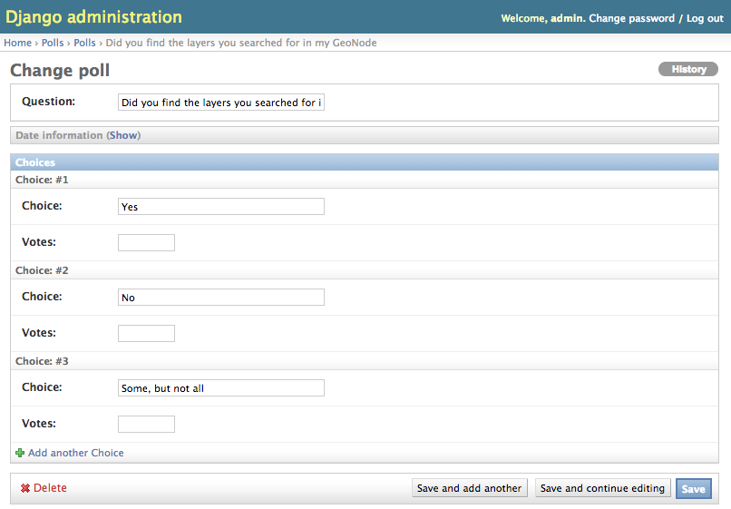
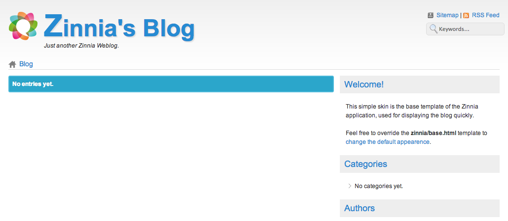
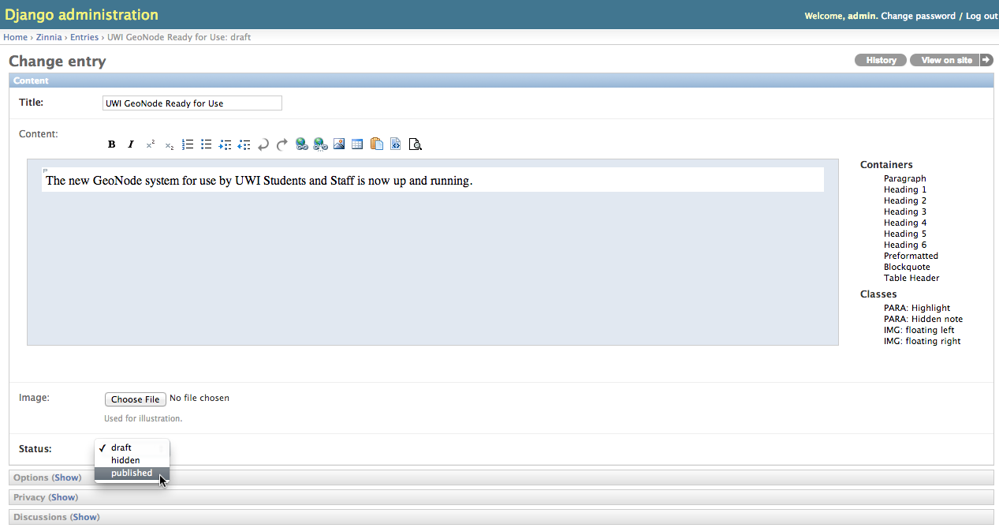
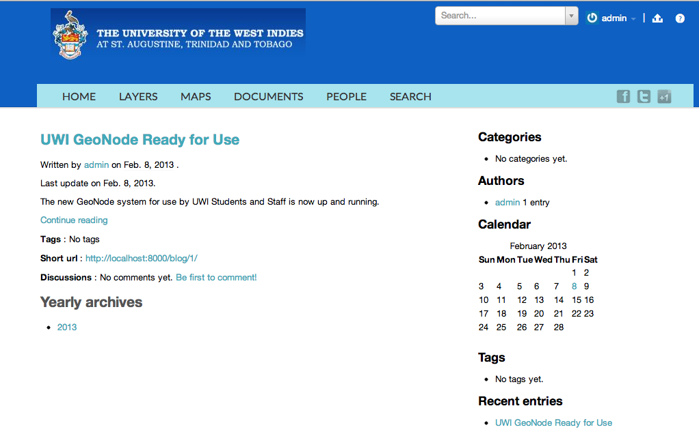
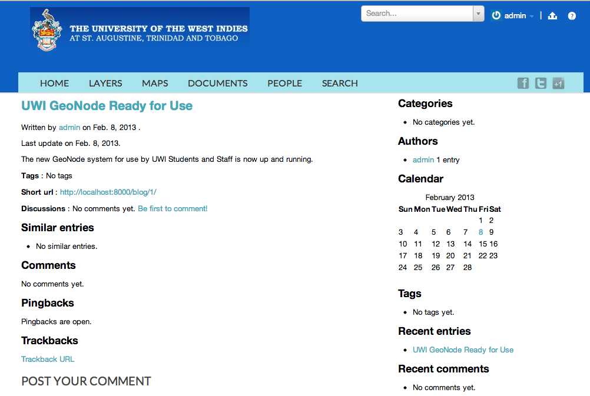
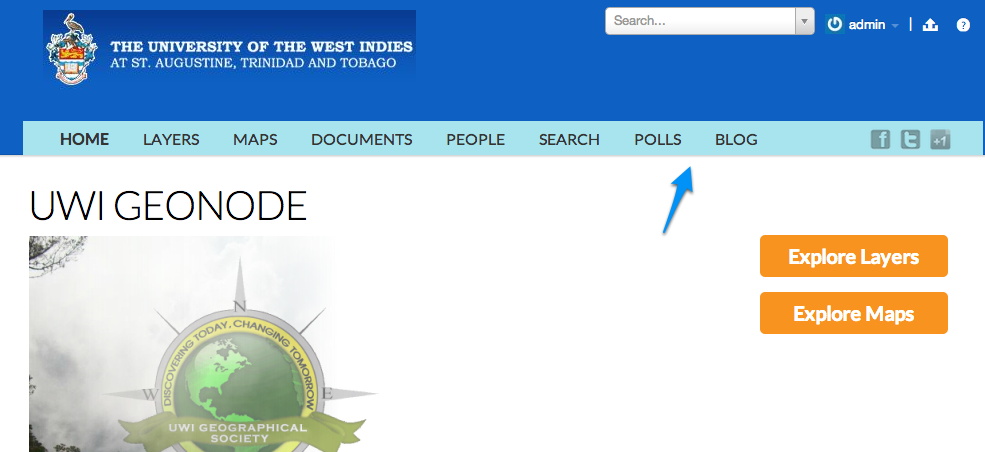
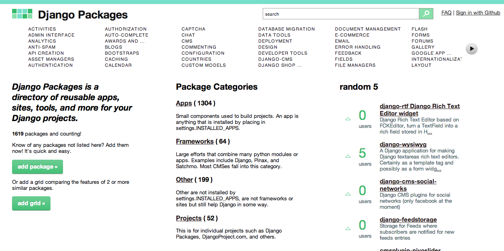

* FORKED FROM HERE AND ADAPTED FOR DOCKER SPC GEONODE 2.10.1 :

https://github.com/markiliffe/geonode/blob/master/docs/tutorials/devel/projects/apps.txt

https://geonode-docs.readthedocs.io/en/latest/tutorials/devel/projects/apps.html

Adding additional Django apps to your GeoNode Project
=====================================================

Since GeoNode is based on Django, your GeoNode project can be augmented and enhanced by adding additional third-party pluggable
Django apps or by writing an app of your own.

This section of the workshop will introduce you to the Django pluggable app ecosystem, and walk you through the process 
of writing your own app and adding a blog app to your project.

.. todo:: This page is a bit long. Consider splitting up into multiple pages.

Django pluggable apps
---------------------

The Django app ecosystem provides a large number of apps that can be added to your project. 
Many are mature and used in many existing projects and sites, while others are under active early-stage development. 
Websites such as `Django Packages` http://www.djangopackages.com/ provide an interface for discovering and comparing 
all the apps that can plugged in to your Django project. You will find that some can be used with very little effort 
on your part, and some will take more effort to integrate.

Adding your own Django app
--------------------------

.. todo:: This section should be put into numbered-steps format to match the rest of the tutorial. DONE!

Let's walk through the an example of the steps necessary to create a very basic Django polling app to and add it to your
GeoNode project. This section is an abridged version of the Django tutorial itself and it is strongly recommended that you
go through this external tutorial along with this section as it provides much more background material and a signficantly 
higher level of detail. You should become familiar with all of the information in the `Django tutorial` 
https://docs.djangoproject.com/en/1.11/intro/tutorial01/ as it is critical to your success as a GeoNode project developer.

.. todo:: Add link to Django tutorial. DONE!

Throughout this section, we will walk through the creation of a basic poll application. It will consist of two parts:

* A public site that lets people view polls and vote in them.
* An admin site that lets you add, change, and delete polls.

#. Create app structure

   Since we have already created our GeoNode project from a template project, we will start by creating our 
   app structure and then adding models:

     
         $ cd geonode/scripts/spcgeonode
         $ docker-compose exec django /spcgeonode/manage.py startapp polls

   That'll create a directory my_app, which is laid out like this::

       geonode/
           polls/
               __init__.py
               models.py
               tests.py
               views.py

   This directory structure will house the my_app application.

#. Add models

   The next step in writing a database web app in Django is to define your models—essentially, your database layout 
   with additional metadata.

   In our simple poll app, we'll create two models: polls and choices. A poll has a question and a publication date. 
   A choice has two fields:    the text of the choice and a vote tally. Each choice is associated with a poll.

   These concepts are represented by simple Python classes.

   .. todo:: Some kind of schematic or other figure describing this would be helpful.

   Edit the `polls/models.py` file so it looks like this:

    # -*- coding: utf-8 -*-
    from __future__ import unicode_literals

    from django.db import models
    from django.utils.encoding import python_2_unicode_compatible

    # Create your models here.

    @python_2_unicode_compatible  # only if you need to support Python 2
    class Question(models.Model):
        question_text = models.CharField(max_length=200)
        pub_date = models.DateTimeField('date published')
        def __str__(self):
            return self.question_text

    @python_2_unicode_compatible  # only if you need to support Python 2
    class Choice(models.Model):
        question = models.ForeignKey(Question, on_delete=models.CASCADE)
        choice_text = models.CharField(max_length=200)
        votes = models.IntegerField(default=0)
        def __str__(self):
            return self.choice_text

   That small bit of model code gives Django a lot of information. With it, Django is able to:

   * Create a database schema (CREATE TABLE statements) for this app.
   * Create a Python database-access API for accessing Poll and Choice objects.

   But first we need to tell our project that the polls app is installed.

   Edit the `<my_geonode>/local_settings.py` file, and update to include the string "polls". So it will look like this:

       INSTALLED_APPS += ('polls',)

   Now Django knows to include the polls app. Let's run another command:

       $ docker-compose exec django /spcgeonode/manage.py makemigrations
       $ docker-compose exec django /spcgeonode/manage.py migrate

   The ``makemigrations`` and ``migrate`` command runs the SQL from ``sqlall (wrong : need update)`` on your database for all apps in 
   INSTALLED_APPS that don't already exist in your database. This creates all the tables, initial data, and indexes 
   for any apps you've added to your project since the last time you ran ``makemigrations`` and ``migrate``. 
   ``makemigrations`` and ``migrate`` can be called as often as you like, and it will only ever create the tables that don't exist.
   More details here : https://docs.djangoproject.com/en/1.11/topics/migrations/

   GeoNode uses south for migrations ...

   .. todo:: Missing content.

#. Add Django Admin Configuration

   Next, let's add the Django admin configuration for our polls app so that we can use the Django Admin to manage the records 
   in our database. Create and edit a new file called `polls/admin.py` and make it look like the this:

    # -*- coding: utf-8 -*-
    from __future__ import unicode_literals
    
    from django.contrib import admin
    
    # Register your models here.
    from .models import Question
   
    admin.site.register(Question)

   Run the development server and explore the polls app in the Django Admin by pointing your browser to 
   http://<geonode_host>/admin/ and logging in with the credentials you specified in `Docker SPC GeoNode .env` file.

  

   You can see all of the other apps that are installed as part of your GeoNode project, 
   but we are specifically interested in the polls app for now.

   

   Next we will add a new poll via automatically generated admin form.

   

   You can enter any sort of question you want for initial testing and select today and now for the publication date.

   

#. Configure Choice model

   The next step is to configure the Choice model in the admin, but we will configure the choices to be editable in-line 
   with the Poll objects they are attached to. Edit the same `polls/admin.py` so it now looks like the following:

    # -*- coding: utf-8 -*-
    from __future__ import unicode_literals
    
    from django.contrib import admin
    
    # Register your models here.
    from .models import Question, Choice
    
    class ChoiceInline(admin.StackedInline):
        model = Choice
        extra = 3
    
    class QuestionAdmin(admin.ModelAdmin):
        fieldsets = [
            (None,               {'fields': ['question_text']}),
            ('Date information', {'fields': ['pub_date'], 'classes': ['collapse']}),
        ]
        inlines = [ChoiceInline]
    
    admin.site.register(Question, QuestionAdmin)

   This tells Django that Choice objects are edited on the Poll admin page, and by default, provide enough fields for 3 choices.

#. Add/edit poll

   You can now return to the Poll admin and either add a new poll or edit the one you already created and see that you can now 
   specify the poll choices inline with the poll itself.

   

#. Create views

   From here, we want to create views to display the polls inside our GeoNode project. 
   A view is a "type" of Web page in your Django application that generally serves a specific function and has a specific 
   template. In our poll application, there will be the following four views:

   * Poll "index" page—displays the latest few polls.
   * Poll "detail" page—displays a poll question, with no results but with a form to vote.
   * Poll "results" page—displays results for a particular poll.
   * Vote action—handles voting for a particular choice in a particular poll.

   The first step of writing views is to design your URL structure. You do this by creating a Python module called a URLconf. 
   URLconfs are how Django associates a given URL with given Python code.

   Let's start by adding our URL configuration directly to the :file:`urls.py` that already exists in your project at 
   `<my_geonode>/urls.py`. Edit this file and add the following lines after the rest of the existing imports :

    urlpatterns += [
    ## include your urls here
    url(r'^polls/', include('polls.urls')),
    ]

   Then configure proper urls for polls. Edit `polls/urls.py` and make it looks like that :
   
    # -*- coding: utf-8 -*-
    from django.conf.urls import url
    
    from . import views
    
    app_name = 'polls'
    urlpatterns = [
        # ex: /polls/
        url(r'^$', views.index, name='index'),
        # ex: /polls/5/
        url(r'^(?P<question_id>[0-9]+)/$', views.detail, name='detail'),
        # ex: /polls/5/results/
        url(r'^(?P<question_id>[0-9]+)/results/$', views.results, name='results'),
        # ex: /polls/5/vote/
        url(r'^(?P<question_id>[0-9]+)/vote/$', views.vote, name='vote'),
        ]

   

   Next write the views to drive the URL patterns we configured above. Edit polls/views.py to that it looks like the following:

   .. code-block:: python

    # -*- coding: utf-8 -*-
    from __future__ import unicode_literals
    
    from django.shortcuts import render
    
    # Create your views here.
    from django.shortcuts import get_object_or_404, render
    from django.http import HttpResponseRedirect, HttpResponse
    from django.urls import reverse
    from django.template import loader
    from .models import Choice, Question
    
    def index(request):
        latest_question_list = Question.objects.order_by('-pub_date')[:5]
        context = {
            'latest_question_list': latest_question_list,
        }
        return render(request, 'polls/index.html', context)

    def detail(request, question_id):
    #    return HttpResponse("You're looking at question %s." % question_id)
        try:
            question = Question.objects.get(pk=question_id)
        except Question.DoesNotExist:
            raise Http404("Question does not exist")
        return render(request, 'polls/detail.html', {'question': question})

    def results(request, question_id):
        question = get_object_or_404(Question, pk=question_id)
        return render(request, 'polls/results.html', {'question': question})

    def vote(request, question_id):
        question = get_object_or_404(Question, pk=question_id)
        try:
            selected_choice = question.choice_set.get(pk=request.POST['choice'])
        except (KeyError, Choice.DoesNotExist):
            # Redisplay the question voting form.
            return render(request, 'polls/detail.html', {
                'question': question,
                'error_message': "You didn't select a choice.",
            })
        else:
            selected_choice.votes += 1
            selected_choice.save()
            # Always return an HttpResponseRedirect after successfully dealing
            # with POST data. This prevents data from being posted twice if a
            # user hits the Back button.
            return HttpResponseRedirect(reverse('polls:results', args=(question.id,)))

   Now we have views in place, but we are referencing templates that do not yet exist. Let's add them by first creating a template directory in your polls app at `polls/templates/polls` and creating `polls/templates/polls/index.html` to look like the following:

    

    <link rel="stylesheet" type="text/css" href="" />

    
        <ul>
        
            <li><a href="">{{ question.question_text }}</a></li>
        
        </ul>
    
        
No polls are available.

    

   Create a new css file in `polls/static/polls/styles.css` and add : 
   
    li a {
     color: green;
    }

   Don't forget to collect static files (`styles.css`) with : 
   
    docker-compose exec django /spcgeonode/manage.py collectstatics
    
    
   Next we need to create the template for the poll detail page. Create a new file at `polls/templates/polls/detail.html` to look like the following:

    <h1>{{ question.question_text }}</h1>

    
<strong>{{ error_message }}</strong>


    <form action="" method="post">
    
    
        <input type="radio" name="choice" id="choice{{ forloop.counter }}" value="{{ choice.id }}" />
        <label for="choice{{ forloop.counter }}">{{ choice.choice_text }}</label> 
    
    <input type="submit" value="Vote" />
    </form>

   Then we want to display results, create a `polls/templates/polls/results.html` :
   
    <h1>{{ question.question_text }}</h1>

    <ul>
    
        <li>{{ choice.choice_text }} -- {{ choice.votes }} vote{{ choice.votes|pluralize }}</li>
    
    </ul>

    <a href="">Vote again?</a>

   
   
   You can now visit http://<geonode-host>/polls/ in your browser and you should see the the poll question you created in the admin presented like this.
  

   .. figure:: img/polls_plain.png

#. Update templates

   We actually want our polls app to display as part of our GeoNode project with the same theme, so let's update the two templates we created above to make them extend from the :file:`site_base.html` template we looked at in the last section. You will need to add the following two lines to the top of each file:

   .. code-block:: html

       
       

   And close the block at the bottom of each file with:

   .. code-block:: html

       

   This tells Django to extend from the :file:`site_base.html` template so your polls app has the same style as the rest of your GeoNode, and it specifies that the content in these templates should be rendered to the body block defined in GeoNode's :file:`base.html` template that your :file:`site_base.html` extends from.

   You can now visit the index page of your polls app and see that it is now wrapped in the same style as the rest of your GeoNode site. 

   

   If you click on a question from the list you will be taken to the poll detail page. 

   

   It looks like it is empty, but in fact the text is there, but styled to be white by the Bootswatch theme we added in the last section. If you highlight the area where the text is, you will see that it is there.

   

Now that you have walked through the basic steps to create a very minimal (though not very useful) Django app and integrated it with your GeoNode project, you should pick up the Django tutorial at part 4 and follow it to add the form for actually accepting responses to your poll questions.

We strongly recommend that you spend as much time as you need with the Django tutorial itself until you feel comfortable with all of the concepts. They are the essential building blocks you will need to extend your GeoNode project by adding your own apps.

Adding a 3rd party blog app 
---------------------------

Now that we have created our own app and added it to our GeoNode project, the next thing we will work through is adding a 3rd party blog app. There are a number of blog apps that you can use, but for purposes of this workshop, we will use a relatively simple, yet extensible app called `Zinnia <http://django-blog-zinnia.com/blog/>`_. You can find out more information about Zinnia on its website or on its `GitHub project page <https://github.com/Fantomas42/django-blog-zinnia>`_ or by following its `documentation <http://django-blog-zinnia.com/documentation/>`_. This section will walk you through the minimal set of steps necessary to add Zinnia to your GeoNode project.

.. todo:: Again, step numbers would be helpful here. DONE!

#. Install Zinnia

   The first thing to do is to install Zinnia into the virtualenv that you are working in. Make sure your virtualenv is activated and execute the following command:

   .. code-block:: console

       $ pip install django-blog-zinnia

   This will install Zinnia and all of the libraries that it depends on. 

#. Add Zinnia to INSTALLED_APPS

   Next add Zinnia to the INSTALLED_APPS section of your GeoNode projects :file:`settings.py` file by editing :file:`<my_geonode>/settings.py` and adding 'django.contrib.comments' to the section labeled "Apps Bundled with Django" so that it looks like the following:

   .. code-block:: python

    # Apps bundled with Django
    'django.contrib.auth',
    'django.contrib.contenttypes',
    'django.contrib.sessions',
    'django.contrib.sites',
    'django.contrib.admin',
    'django.contrib.sitemaps',
    'django.contrib.staticfiles',
    'django.contrib.messages',
    'django.contrib.humanize',
    'django.contrib.comments',

   And then add the ``tagging``, ``mptt`` and ``zinnia`` apps to the end of the INSTALLED_APPS where we previously added a section labeled "My GeoNode apps". It should like like the following:

   .. code-block:: python

    # My GeoNode apps
    'polls',
    'tagging',
    'mptt',
    'zinnia',

#. Synchronize models

   Next you will need to run ``syncdb`` again to synchronize the models for the apps we have just added to our project's database. This time we want to pass the ``--all`` flag to ``syncdb`` so it ignores the schema migrations. Schema migrations are discussed further in GeoNode's documentation, but it is safe to ignore them here.

   .. code-block:: console

      $ python manage.py syncdb --all

   You can now restart the development server and visit the Admin interface and scroll to the very bottom of the list to find a section for Zinnia that allows you to manage database records for Categories and Blog Entries.

   

#. Configure project

   Next we need to configure our project to add Zinnia's URL configurations. Add the following two URL configuration entries to the end of :file:`<my_geonode>/urls.py`:

   .. code-block:: python

       url(r'^blog/', include('zinnia.urls')),
       url(r'^djcomments/', include('django.contrib.comments.urls')),

   If you visit the main blog page in your browser at http://localhost:8000/blog/ you will find that the blog displays with Zinnia's default theme as shown below.

   .. note:: If you are not able to visit the main blog page, you will have to set ``USE_TZ = True`` in settings.py. Restart the server and try again!

   

   This page includes some guidance for us on how to change the default theme. 

#. Change default theme

   The first thing we need to do is to copy Zinnia's :file:`base.html` template into our own project so we can modify it. When you installed Zinnia, templates were installed to :file:`/var/lib/geonode/lib/python2.7/site-packages/zinnia/templates/zinnia/`. You can copy the base template by executing the following commands:

   .. code-block:: console

       $ mkdir <my_geonode>/templates/zinnia
       $ cp /var/lib/geonode/lib/python2.7/site-packages/zinnia/templates/zinnia/base.html <my_geonode>/templates/zinnia/

   Then you need to edit this file and change the topmost line to read as below such that this template extends from our projects :file:`site_base.html` rather than the zinnia :file:`skeleton.html`:

   .. code-block:: html

       

   Since Zinnia uses a different block naming scheme than GeoNode does, you need to add the following line to the bottom of your site_base.html file so that the content block gets rendered properly:

   .. code-block:: html

       

   .. figure:: img/zinnia_geonode.png 

   You can see that there are currently no blog entries, so let's add one. Scroll to the bottom of the interface and click the :guilabel:`Post an Entry` link to go to the form in the Admin interface that lets you create a blog post. Go ahead and fill out the form with some information for testing purposes. Make sure that you change the Status dropdown to "published" so the post shows up right away.

   

   You can explore all of the options available to you as you create your post, and when you are done, click the :guilabel:`Save` button. You will be taken to the page that shows the list of all your blog posts.  

   

   You can then visit your blog post/entry at http://localhost:8000/blog/.

   

   And if you click on the blog post title, you will be taken to the page for the complete blog post. You and your users can leave comments on this post and various other blog features from this page.  

   

#. Integrate app into your site

   The last thing we need to do to fully integrate this blog app (and our polls app) into our site is to add it to the options on the navbar. To do so, we need to add the following block override to our Projects :file:`site_base.html`:

   .. code-block:: html

       
       <li id="nav_polls">
           <a href="/polls/">Polls</a>
       </li>
       <li id="nav_blog">
           <a href="">Blog</a>
       </li>
       

   

At this point, you could explore options for tighter integration between your GeoNode project and Zinnia. Integrating blog posts from Zinnia into your overall search could be useful, as well as including the blog posts a user has written on their Profile Page. You could also explore the additional plugins that go with Zinnia.  

Adding other apps 
-----------------

Now that you have both written your own app and plugged in a 3rd party one, you can explore sites like Django Packages to look for other modules that you could plug into your GeoNode project to meet your needs and requirements. For many types of apps, there are several options and Django Packages is a nice way to compare them. You may find that some apps require significantly more work to integrate into your app than others, but reaching out to the app's author and/or developers should help you get over any difficulties you may encounter.

